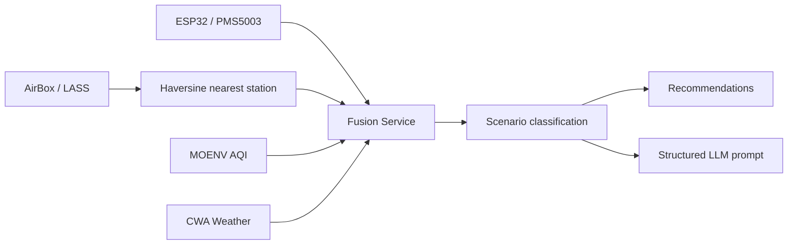

# Architecture

AirFusion AI follows the source document's three-scale model.

## Data Layers

1. Local
   ESP32 and PMS5003 publish high-frequency personal exposure readings through MQTT.

2. Neighborhood
   AirBox/LASS stations provide nearby community background values every few minutes.

3. Regional
   MOENV and CWA provide official AQI, pollutant data, weather trend, wind, rain, and humidity.

## Fusion Flow

## Scenario Rules

- Indoor source: local PM2.5 is much higher than outdoor background.
- Neighborhood hotspot: local and AirBox are high, but official station is lower.
- Regional pollution: all scales are high.
- Official alert: official AQI is unhealthy even if local data is not yet elevated.
- Normal: no strong cross-scale anomaly.

These rules are intentionally explicit for the first version. They can later be replaced by a trained model while keeping the same provider and API contracts.
